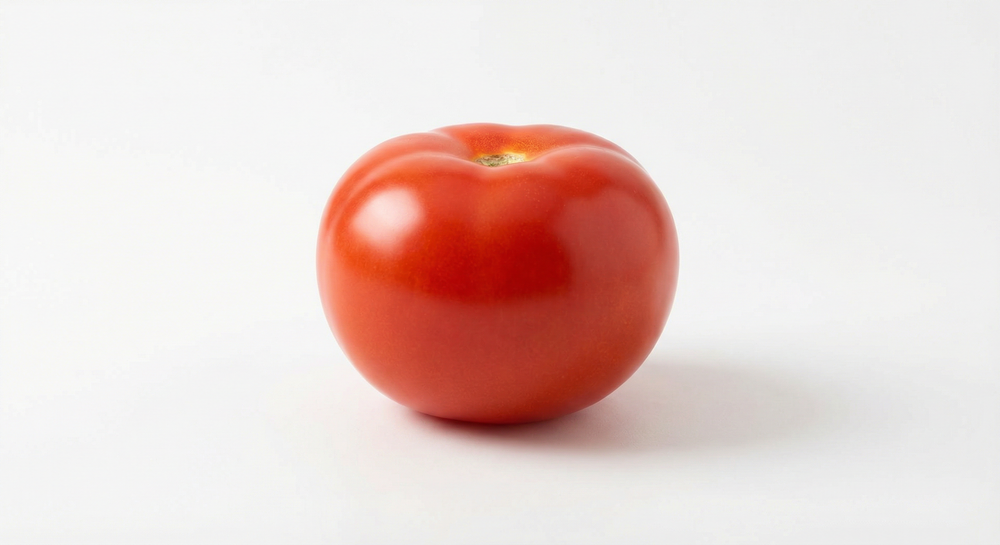
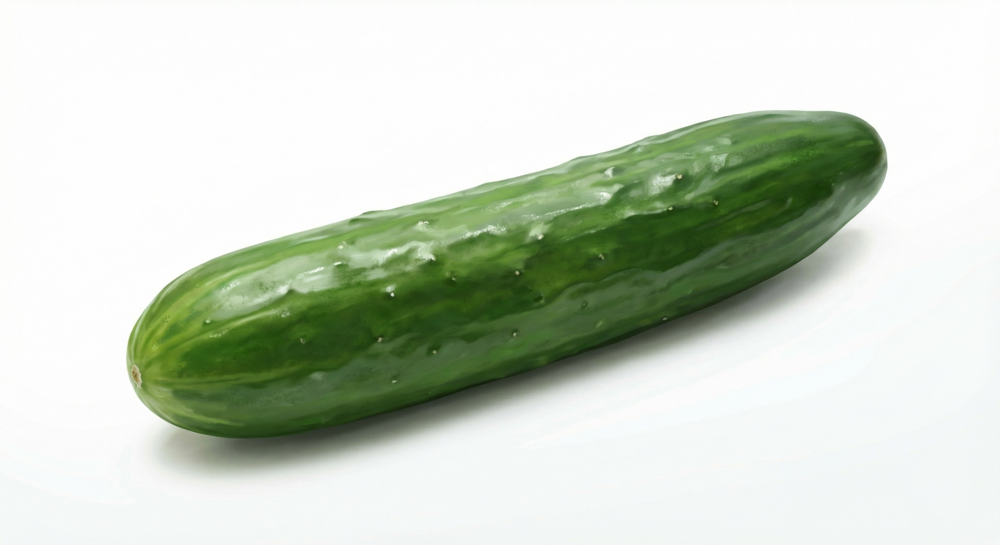
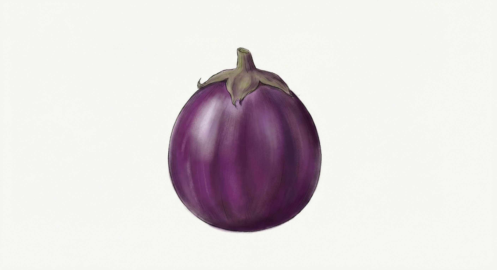
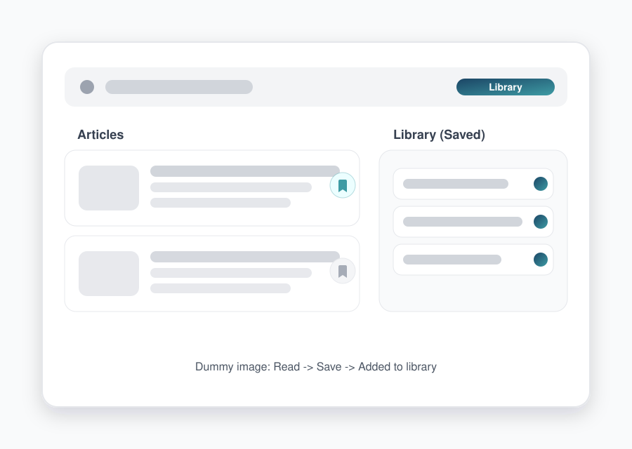
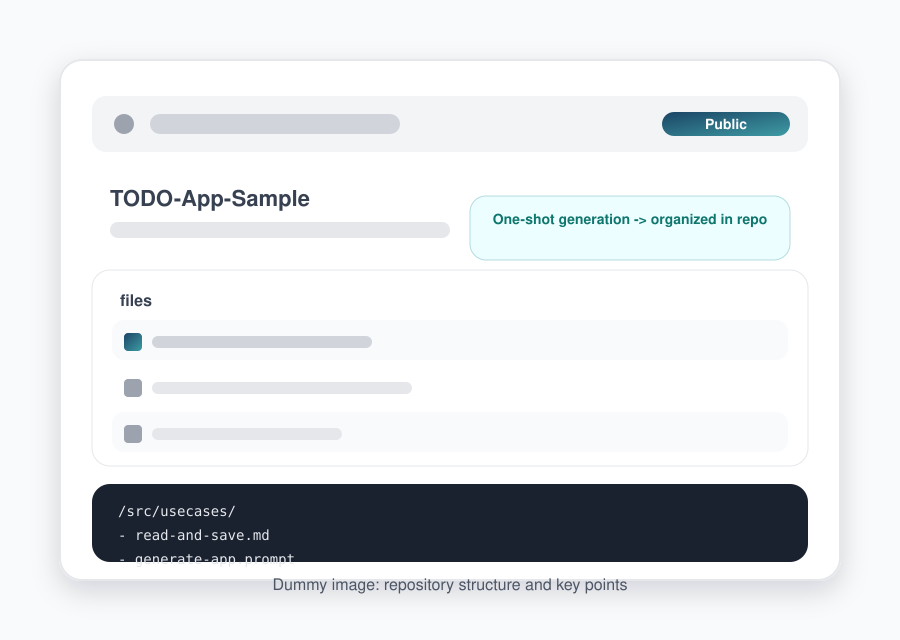
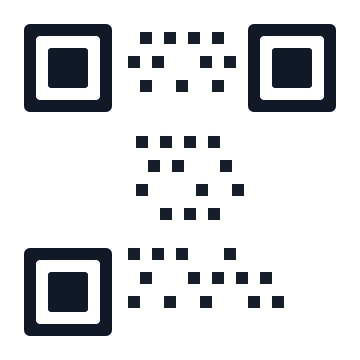

<!-- _class: title-slide -->

# タイトル
<!-- パターン: A. タイトル・セクション系 / 用途: 冒頭でテーマと登壇情報を提示し、期待値を揃える時。 -->
## サブタイトル

Yuki Yoshinaga   
202X年X月X日

---

<!-- _class: toc-slide -->

<div class="toc-layout">

<div>

<div class="toc-title-group">
  <h1>目次</h1>
  <h2>Index</h2>
  <!-- パターン: A. タイトル・セクション系 / 用途: 全体構成を提示し、聞き手の「地図」を作る時。 -->
</div>

</div>

<div>

1. セクションA
2. セクションB
3. セクションC
4. セクションD
5. セクションE

</div>

</div>

---

<!-- _class: section-start -->

# セクション開始
<!-- パターン: A. タイトル・セクション系 / 用途: 章の切り替わりに使うインパクトのあるパターン。 -->
## セクションタイトル

---

## ここにタイトルが入ります
<!-- パターン: A. タイトル・セクション系 / 用途: 導入の問題提起を文章で説明する通常スライド。 -->

ここに説明文が入ります。

**ここに強調文が入ります。**

---

## ここにタイトルが入ります
<!-- パターン: A. タイトル・セクション系 / 用途: フォーマットや書式をコード例で示す時。 -->

```markdown
# サンプルタイトル
- 項目A
- 項目B
- 項目C
- 項目D
```

ここに説明文が入ります。

---

## 2カラム比較：Before/After
<!-- パターン: B. カラムレイアウト系 / 用途: 変更前後の比較を端的に見せたい時。 -->

<div class="grid-2col">

<div class="mb-0">

<h2 style="margin: 0 0 24px 0; font-size: 28px; font-weight: 700; color: #374151;">Before</h2>
<div style="font-size: 24px; color: #1F2937; margin-bottom: 16px;">
ここに短い説明が入ります
</div>
<div style="font-size: 26px; color: #4B5563; font-style: italic;">
「ここに例文が入ります」
</div>

</div>

<div>

<h2 style="margin: 0 0 24px 0; font-size: 28px; font-weight: 700; color: #374151;">After</h2>
<div style="font-size: 24px; color: #1F2937; margin-bottom: 16px;">
ここに短い説明が入ります
</div>
<ul style="font-size: 26px; color: #1F2937; margin: 0; padding-left: 24px;">
<li>項目A</li>
<li>項目B</li>
<li>項目C</li>
<li>項目D</li>
</ul>

</div>

</div>

---


## 2カラム対比：タイトル
<!-- パターン: B. カラムレイアウト系 / 用途: 2つの性質や考え方を対比して示す時。 -->

<div class="grid-2col">

<div class="panel">

<h2 style="margin: 0 0 20px 0; font-size: 24px; font-weight: 700; color: #374151;">項目A</h2>
<ul style="font-size: 26px; color: #1F2937; margin: 0; padding-left: 24px;">
<li>説明文A</li>
<li>説明文B</li>
<li>説明文C</li>
</ul>

</div>

<div class="panel">

<h2 style="margin: 0 0 20px 0; font-size: 24px; font-weight: 700; color: #374151;">項目B</h2>
<ul style="font-size: 26px; color: #1F2937; margin: 0; padding-left: 24px;">
<li>説明文A</li>
<li>説明文B</li>
<li>説明文C</li>
</ul>

</div>

</div>

---


## 3カラムレイアウト：タイトル
<!-- パターン: B. カラムレイアウト系 / 用途: 構成要素を3点で整理したい時。 -->

<div class="grid-3col">

<div class="panel">

<h2 style="margin: 0 0 20px 0; font-size: 24px; font-weight: 700; color: #374151;">タイトルA</h2>
<div style="font-size: 26px; color: #1F2937;">
テキスト  
テキスト
</div>

</div>

<div class="panel">

<h2 style="margin: 0 0 20px 0; font-size: 24px; font-weight: 700; color: #374151;">タイトルB</h2>
<div style="font-size: 26px; color: #1F2937;">
テキスト  
テキスト
</div>

</div>

<div class="panel">

<h2 style="margin: 0 0 20px 0; font-size: 24px; font-weight: 700; color: #374151;">タイトルC</h2>
<div style="font-size: 26px; color: #1F2937;">
テキスト  
テキスト
</div>

</div>

</div>

---


## 3カラム（アクセント）
<!-- パターン: B. カラムレイアウト系 / 用途: 重要ポイントをアクセントで強調したい時。 -->

<div class="grid-3col">

<div class="accent-card">

<h2 style="margin: 0 0 24px 0; font-size: 24px; font-weight: 700; color: #374151;">タイトルA</h2>
<div style="color: #1F2937;">
ここに説明文が入ります
</div>

</div>

<div class="accent-card-brand">

<h2 style="margin: 0 0 24px 0; font-size: 24px; font-weight: 700; color: #374151;">タイトルB</h2>
<div style="color: #1F2937;">
ここに説明文が入ります
</div>

</div>

<div class="accent-card">

<h2 style="margin: 0 0 24px 0; font-size: 24px; font-weight: 700; color: #374151;">タイトルC</h2>
<div style="color: #1F2937;">
ここに説明文が入ります
</div>

</div>

</div>

---

## 3カラム画像付き
<!-- パターン: B. カラムレイアウト系 / 用途: 画像付きカードを3つ並べて紹介したい時。 -->

<div class="image-card-grid">
  <div class="image-card">
    
    <div class="image-card-content">
      <div class="image-card-title">タイトルA</div>
      <div class="image-card-text">ここに説明文が入ります</div>
      <div class="image-card-tag">#タグ</div>
    </div>
  </div>
  <div class="image-card">
    
    <div class="image-card-content">
      <div class="image-card-title">タイトルB</div>
      <div class="image-card-text">ここに説明文が入ります</div>
      <div class="image-card-tag">#タグ</div>
    </div>
  </div>
  <div class="image-card">
    
    <div class="image-card-content">
      <div class="image-card-title">タイトルC</div>
      <div class="image-card-text">ここに説明文が入ります</div>
      <div class="image-card-tag">#タグ</div>
    </div>
  </div>
</div>

---

## 4カラムレイアウト：タイトル
<!-- パターン: B. カラムレイアウト系 / 用途: 4つの利点・項目を並列に示す時。 -->

<div class="grid-4col">

<div class="panel panel-center">

<h3 style="margin: 0 0 16px 0; font-size: 26px; font-weight: 600; color: #374151;">タイトルA</h3>
<div style="font-size: 24px; color: #4B5563;">
ここに説明文が入ります
</div>

</div>

<div class="panel panel-center">

<h3 style="margin: 0 0 16px 0; font-size: 26px; font-weight: 600; color: #374151;">タイトルB</h3>
<div style="font-size: 24px; color: #4B5563;">
ここに説明文が入ります
</div>

</div>

<div class="panel panel-center">

<h3 style="margin: 0 0 16px 0; font-size: 26px; font-weight: 600; color: #374151;">タイトルC</h3>
<div style="font-size: 24px; color: #4B5563;">
ここに説明文が入ります
</div>

</div>

<div class="panel panel-center">

<h3 style="margin: 0 0 16px 0; font-size: 26px; font-weight: 600; color: #374151;">タイトルD</h3>
<div style="font-size: 24px; color: #4B5563;">
ここに説明文が入ります
</div>

</div>

</div>

---


## 5カラム：成熟度レベル
<!-- パターン: B. カラムレイアウト系 / 用途: レベルや成熟度を段階的に示す時。 -->

<div class="level-strip">
  <div class="level-item level-1">
    <div class="level-title">Lv.1 タイトル</div>
    <div class="level-desc">ここに説明文が入ります</div>
  </div>
  <div class="level-item level-2">
    <div class="level-title">Lv.2 タイトル</div>
    <div class="level-desc">ここに説明文が入ります</div>
  </div>
  <div class="level-item level-3">
    <div class="level-title">Lv.3 タイトル</div>
    <div class="level-desc">ここに説明文が入ります</div>
  </div>
  <div class="level-item level-4">
    <div class="level-title">Lv.4 タイトル</div>
    <div class="level-desc">ここに説明文が入ります</div>
  </div>
  <div class="level-item level-5">
    <div class="level-title">Lv.5 タイトル</div>
    <div class="level-desc">ここに説明文が入ります</div>
  </div>
</div>

---


## 2x2グリッド：タイトル
<!-- パターン: B. カラムレイアウト系 / 用途: 4象限で用途や分類を整理したい時。 -->

<div class="grid-2col">

<div class="panel panel-compact">

<h2 style="margin: 0 0 12px 0; font-size: 22px; font-weight: 700; color: #374151;">カテゴリA</h2>
<div style="font-size: 24px; color: #4B5563;">
テキスト  
テキスト
</div>

</div>

<div class="panel panel-compact">

<h2 style="margin: 0 0 12px 0; font-size: 22px; font-weight: 700; color: #374151;">カテゴリB</h2>
<div style="font-size: 24px; color: #4B5563;">
テキスト  
テキスト
</div>

</div>

<div class="panel panel-compact">

<h2 style="margin: 0 0 12px 0; font-size: 22px; font-weight: 700; color: #374151;">カテゴリC</h2>
<div style="font-size: 24px; color: #4B5563;">
テキスト  
テキスト
</div>

</div>

<div class="panel panel-compact">

<h2 style="margin: 0 0 12px 0; font-size: 22px; font-weight: 700; color: #374151;">カテゴリD</h2>
<div style="font-size: 24px; color: #4B5563;">
テキスト  
テキスト
</div>

</div>

</div>

---


## 3x2グリッド：タイトル
<!-- パターン: B. カラムレイアウト系 / 用途: 複数の短い実例を一覧で見せたい時。 -->

<div class="grid-3x2-compact">

<div class="panel panel-compact">

<h3 style="margin: 0 0 6px 0; font-size: 18px; font-weight: 600; color: #374151;">タイトルA</h3>
<div style="font-size: 20px; color: #4B5563; margin: 0;">
ここに説明文が入ります
</div>

</div>

<div class="panel panel-compact">

<h3 style="margin: 0 0 6px 0; font-size: 18px; font-weight: 600; color: #374151;">タイトルB</h3>
<div style="font-size: 20px; color: #4B5563; margin: 0;">
ここに説明文が入ります
</div>

</div>

<div class="panel panel-compact">

<h3 style="margin: 0 0 6px 0; font-size: 18px; font-weight: 600; color: #374151;">タイトルC</h3>
<div style="font-size: 20px; color: #4B5563; margin: 0;">
ここに説明文が入ります
</div>

</div>

<div class="panel panel-compact">

<h3 style="margin: 0 0 6px 0; font-size: 18px; font-weight: 600; color: #374151;">タイトルD</h3>
<div style="font-size: 20px; color: #4B5563; margin: 0;">
ここに説明文が入ります
</div>

</div>

<div class="panel panel-compact">

<h3 style="margin: 0 0 6px 0; font-size: 18px; font-weight: 600; color: #374151;">タイトルE</h3>
<div style="font-size: 20px; color: #4B5563; margin: 0;">
ここに説明文が入ります
</div>

</div>

<div class="panel panel-compact">

<h3 style="margin: 0 0 6px 0; font-size: 18px; font-weight: 600; color: #374151;">タイトルF</h3>
<div style="font-size: 20px; color: #4B5563; margin: 0;">
ここに説明文が入ります
</div>

</div>

</div>

---


## ステップリスト：タイトル
<!-- パターン: C. リスト系 / 用途: 手順を順番に伝えたい時。 -->

1. **項目**の説明文が入ります
2. **項目**の説明文が入ります
3. **項目**の説明文が入ります
4. **項目**の説明文が入ります
5. **項目**の説明文が入ります
6. **項目**の説明文が入ります
7. **項目**の説明文が入ります
8. **項目**の説明文が入ります

---

## 定義 + ステップ例（右パネル）
<!-- パターン: B. カラムレイアウト系 / 用途: 左で定義、右で手順例を見せて理解を固定したい時。 -->

<div class="grid-2col-center">

<div>

<h2 style="margin: 0 0 24px 0; font-size: 28px; font-weight: 700; color: #374151;">ユースケース記述</h2>

<div style="font-size: 26px; color: #1F2937; line-height: 1.6;">
主体ごとの挙動を、シナリオベースで叙述した作文。<br>
物事が起きる順に、行動とシステムの反応を並べる。
</div>

</div>

<div class="panel">

<ol class="usecase-steps">
  <li>ユーザーはホーム画面を開く</li>
  <li>アプリはホーム画面を表示する</li>
  <li>アプリはニュース一覧を表示する</li>
  <li>ユーザーはいずれかのニュースを開く</li>
  <li>アプリは当該ニュースを表示する</li>
  <li>ユーザーは...</li>
</ol>

</div>

</div>

---


## タイムライン：タイトル
<!-- パターン: C. リスト系 / 用途: 時系列の流れを示したい時。 -->

<ol class="timeline">
  <li>ここに工程名が入ります</li>
  <li>ここに工程名が入ります</li>
  <li>ここに工程名が入ります</li>
  <li>ここに工程名が入ります</li>
</ol>

---


## アイコン付きリスト：タイトル
<!-- パターン: C. リスト系 / 用途: 特徴を視覚的に分かりやすく伝える時。 -->

<ul class="icon-card-list">
  <li class="icon-card">
    <span class="icon-badge">📝</span>
    <div class="icon-card-content">
      <div class="icon-card-title">タイトルA</div>
      <div class="icon-card-body">ここに説明文が入ります</div>
    </div>
  </li>
  <li class="icon-card">
    <span class="icon-badge">🎯</span>
    <div class="icon-card-content">
      <div class="icon-card-title">タイトルB</div>
      <div class="icon-card-body">ここに説明文が入ります</div>
    </div>
  </li>
  <li class="icon-card">
    <span class="icon-badge">⚡</span>
    <div class="icon-card-content">
      <div class="icon-card-title">タイトルC</div>
      <div class="icon-card-body">ここに説明文が入ります</div>
    </div>
  </li>
</ul>

---


## チェックリスト：タイトル
<!-- パターン: C. リスト系 / 用途: 確認項目や達成条件を一覧化する時。 -->

<div class="checklist">

<div class="checklist-item">
<div class="checklist-checkbox">☑</div>
<div class="checklist-text">ここに確認項目が入ります</div>
</div>

<div class="checklist-item">
<div class="checklist-checkbox">☑</div>
<div class="checklist-text">ここに確認項目が入ります</div>
</div>

<div class="checklist-item">
<div class="checklist-checkbox">☑</div>
<div class="checklist-text">ここに確認項目が入ります</div>
</div>

<div class="checklist-item">
<div class="checklist-checkbox">☑</div>
<div class="checklist-text">ここに確認項目が入ります</div>
</div>

<div class="checklist-item">
<div class="checklist-checkbox">☑</div>
<div class="checklist-text">ここに確認項目が入ります</div>
</div>

<div class="checklist-item unchecked">
<div class="checklist-checkbox">☐</div>
<div class="checklist-text">ここに確認項目が入ります（オプション）</div>
</div>

<div class="checklist-item unchecked">
<div class="checklist-checkbox">☐</div>
<div class="checklist-text">ここに確認項目が入ります（オプション）</div>
</div>

</div>

---


## 基本パネル
<!-- パターン: D. パネルデザイン系 / 用途: まとまった説明をパネルで読みやすく提示したい時。 -->

<div class="panel">

<h2 style="margin: 0 0 24px 0; font-size: 32px; font-weight: 700; color: #374151;">ここにタイトルが入ります</h2>

<div style="font-size: 24px; color: #1F2937; line-height: 1.6;">
ここに説明文が入ります。

ここに説明文が入ります。

ここに説明文が入ります。
</div>

</div>

---


## 強調パネル
<!-- パターン: D. パネルデザイン系 / 用途: 重要メッセージを背景色で強調したい時。 -->

<div class="panel panel-strong">

<h2 style="margin: 0 0 24px 0; font-size: 32px; font-weight: 700;">ここにタイトルが入ります</h2>

<div>
ここに説明文が入ります。

ここに強調文が入ります。
</div>

</div>

---


## ガラス風パネル
<!-- パターン: D. パネルデザイン系 / 用途: 背景の上に“浮かぶ”情報パネルを置きたい時（装飾多め）。 -->

<div class="panel panel-glass">

<h2 style="margin: 0 0 24px 0; font-size: 32px; font-weight: 700; color: #374151;">ここにタイトルが入ります</h2>

<div style="font-size: 24px; color: #1F2937; line-height: 1.6;">
ここに説明文が入ります。
</div>

</div>

---


## グラデーションパネル
<!-- パターン: D. パネルデザイン系 / 用途: 事例やストーリーを少しリッチに見せたい時。 -->

<div class="panel panel-gradient">

<h2 style="margin: 0 0 24px 0; font-size: 32px; font-weight: 700; color: #374151;">ここにタイトルが入ります</h2>

<div style="font-size: 24px; color: #1F2937; line-height: 1.6;">
  <p>ここに説明文が入ります。</p>
  <p><strong>ここに強調文が入ります。</strong></p>
</div>

</div>

---


## ボーダーパネル
<!-- パターン: D. パネルデザイン系 / 用途: 枠線で情報ブロックを明確に区切りたい時。 -->

<div style="background: #FFFFFF; padding: 32px; border-radius: 8px; border: 2px solid var(--color-link);">

<h2 style="margin: 0 0 24px 0; font-size: 32px; font-weight: 700; color: #374151;">ここにタイトルが入ります</h2>

```markdown
# サンプルタイトル
- 項目A
- 項目B
- 項目C
- 項目D
```

<div style="font-size: 24px; color: #1F2937; margin-top: 16px;">
ここに説明文が入ります。
</div>

</div>

---


<!-- _class: fullscreen-background -->
<!-- パターン: E. 背景・画像系 / 用途: 章の切り替えや強い主張で、全画面背景で印象づけたい時。 -->
<style scoped>
section {
  background: linear-gradient(135deg, #0536AF 0%, #3163E3 55%, #F4F754 100%);
  color: white;
  padding: 56px !important;
}

section h1 {
  color: white;
  font-size: 72px;
  font-weight: 800;
  line-height: 1.2;
  margin: 0 0 48px 0;
  letter-spacing: -0.02em;
  text-shadow: 0 4px 20px rgba(0, 0, 0, 0.3);
  text-align: left;
}

section p {
  color: white;
  font-size: 32px;
  line-height: 1.6;
  margin: 0;
  opacity: 0.95;
  font-weight: 300;
  text-align: left;
}
</style>

# ここにタイトルが入ります

ここに説明文が入ります

ここに説明文が入ります

---

<!-- _class: fullscreen-background -->
<!-- パターン: E. 背景・画像系 / 用途: 写真を全面背景にして“空気感”を作りたい時（文字は最小限）。 -->
<style scoped>
section {
  background-image: url('../sampleAssets/sam 2.png');
  background-size: cover;
  background-position: center;
  background-repeat: no-repeat;
  color: white;
  padding: 56px !important;
}

section h1 {
  color: white;
  font-size: 72px;
  font-weight: 800;
  line-height: 1.2;
  margin: 0 0 48px 0;
  letter-spacing: -0.02em;
  text-shadow: 0 2px 6px rgba(0, 0, 0, 0.25);
  text-align: left;
}

section p {
  color: white;
  font-size: 32px;
  line-height: 1.6;
  margin: 0;
  opacity: 0.95;
  font-weight: 300;
  text-align: left;
  text-shadow: 0 1px 3px rgba(0, 0, 0, 0.2);
}

section footer {
  display: flex;
  border-top-color: rgba(255, 255, 255, 0.35);
  color: rgba(255, 255, 255, 0.8);
}

section footer::after {
  color: #FFFFFF;
}
</style>

# 背景全面：画像サンプル

画像をスライド全面に配置した例です。テキストは白とシャドウで可読性を確保しています。

---

<!-- _class: fullscreen-background quote-overlay -->
<!-- パターン: E. 背景・画像系 / 用途: 背景画像＋オーバーレイ＋引用で印象的なメッセージを伝えたい時。 -->
<style scoped>
section {
  background-image: url('../sampleAssets/sam 2.png');
  background-size: cover;
  background-position: center;
  background-repeat: no-repeat;
  color: white;
  padding: 56px !important;
}

.quote-accent {
  background: rgba(0, 0, 0, 0.38) !important;
  padding: 28px 32px !important;
  border-radius: 0 !important;
  border-left: none !important;
  margin: 0 !important;
}

blockquote {
  color: white !important;
  font-size: 32px !important;
  line-height: 1.6 !important;
  margin: 0 !important;
  opacity: 0.95;
  font-weight: 400;
  text-align: left;
  text-shadow: 0 1px 3px rgba(0, 0, 0, 0.2);
  border-left: 4px solid var(--color-primary) !important;
  padding: 0 0 0 24px !important;
}

blockquote p {
  color: white !important;
  font-size: 32px !important;
  line-height: 1.6 !important;
  margin: 0 !important;
  opacity: 0.95;
  font-weight: 400;
  text-align: left;
  text-shadow: 0 1px 3px rgba(0, 0, 0, 0.2);
}

blockquote strong {
  font-weight: 600;
  letter-spacing: 0.01em;
  color: white !important;
}
</style>

<div class="quote-accent">

> ここに引用文が入ります。  
> 複数行で記載できます。  
> <strong>強調したい部分</strong>はstrongタグで囲みます。
>
> ー 引用元

</div>

---

<!-- _class: fullscreen-background -->
<!-- パターン: E. 背景・画像系 / 用途: 事例紹介など、背景画像＋ロゴ＋説明文＋補足要素を配置したい時。 -->
<style scoped>
section {
  background-image: url('../sampleAssets/temporary-art.png');
  background-size: cover;
  background-position: center;
  background-repeat: no-repeat;
  color: white;
  padding: 56px !important;
}

.panel-glass {
  max-width: 50%;
}
</style>


<p>
製品やサービスの説明文がここに入ります。<br>
背景画像の上でも読みやすい白文字とシャドウを使用しています。
</p>

<div class="panel panel-glass" style="padding: 24px;">
  
</div>

---

## 右側配置：サンプル
<!-- パターン: E. 背景・画像系 / 用途: 右にビジュアル、左に説明を置きたい時。 -->

<div class="grid-2col-center">

<div>

<h2 style="margin: 0 0 24px 0; font-size: 28px; font-weight: 700; color: #374151;">ここにタイトルが入ります</h2>

<ul style="font-size: 26px; color: #1F2937; margin: 0; padding-left: 24px;">
<li><strong>項目</strong>の説明文が入ります</li>
<li><strong>項目</strong>の説明文が入ります</li>
<li><strong>項目</strong>の説明文が入ります</li>
<li><strong>項目</strong>の説明文が入ります</li>
<li><strong>項目</strong>の説明文が入ります</li>
</ul>

</div>

<div class="explain-figure">
  
</div>

</div>

---


## 左側配置：サンプル
<!-- パターン: E. 背景・画像系 / 用途: 左にビジュアル、右に説明を置きたい時。 -->

<div class="grid-2col-center">

<div class="explain-figure">
  
</div>

<div>

<h2 style="margin: 0 0 24px 0; font-size: 28px; font-weight: 700; color: #374151;">ここにタイトルが入ります</h2>

<ul style="font-size: 26px; color: #1F2937; margin: 0; padding-left: 24px;">
<li>ここに説明文が入ります</li>
<li>ここに説明文が入ります</li>
<li>ここに長めの説明文が入ります</li>
</ul>

</div>

</div>

---


## 右側全面画像
<!-- パターン: E. 背景・画像系 / 用途: 右側を写真で全面的に見せたい時。 -->

<div class="right-image-full">
  <div>
    <h2 style="margin: 0 0 24px 0; font-size: 28px; font-weight: 700; color: #374151;">ここにタイトルが入ります</h2>
    <ul style="font-size: 26px; color: #1F2937; margin: 0; padding-left: 24px;">
      <li>ここに説明文が入ります</li>
      <li>ここに説明文が入ります</li>
      <li>ここに説明文が入ります</li>
    </ul>
  </div>
  <div class="image-pane">
    
  </div>
</div>

---

## 大きめ画像（単独）
<!-- パターン: E. 背景・画像系 / 用途: 画像のみをセーフエリアギリギリまで大きく見せたい時。UIスクリーンショットやデモ画面などに最適。 -->

<div class="center">


</div>

---

## 引用スライド
<!-- パターン: E. 背景・画像系 / 用途: 引用や印象的な一文を強調したい時。 -->

<div class="quote-accent">

> ここに引用文が入ります。
>
> ここに引用文が入ります。
>
> ここに引用文が入ります。

</div>

---


## 統計スライド
<!-- パターン: F. 強調・特殊系 / 用途: 重要な数値を強く印象づけたい時。 -->

<div class="center safe-area center-stack stat-slide">

<div class="stat-number">1</div>

<div class="stat-title">ここにタイトルが入ります</div>

<div class="stat-caption">ここに補足文が入ります</div>

</div>

---


<div class="center safe-area center-stack">
<!-- パターン: F. 強調・特殊系 / 用途: 強い一文メッセージを中央に置いて記憶に残したい時。 -->

# ここに訴求文が入ります

<div class="text-block" style="font-size: 28px; color: var(--color-subheading); margin-top: 16px;">
ここに説明文が入ります
</div>

</div>

---


## Q&Aスライド
<!-- パターン: F. 強調・特殊系 / 用途: よくある質問と回答を整理して示す時。 -->

<div class="stack-32">

<div class="panel">

<h2 style="margin: 0 0 20px 0; font-size: 24px; font-weight: 700; color: #374151;">Q. ここに質問文が入ります</h2>

<div style="font-size: 26px; color: #1F2937; line-height: 1.6;">
A. ここに回答文が入ります。
</div>

</div>

<div class="panel">

<h2 style="margin: 0 0 20px 0; font-size: 24px; font-weight: 700; color: #374151;">Q. ここに質問文が入ります</h2>

<div style="font-size: 26px; color: #1F2937; line-height: 1.6;">
A. ここに回答文が入ります。
</div>

</div>

</div>

---


<!-- パターン: F. 強調・特殊系 / 用途: 聞き手に考えさせたい問いかけを提示する時。 -->
<div class="center safe-area center-stack question-slide">

# ここに問いかけのタイトルが入ります

<p>ここに問いかけの説明文が入ります</p>

</div>

---

## QRコード：参考資料
<!-- パターン: G. 応用パターン / 用途: 参照リンクや資料への導線を提示する時。 -->

<div class="center safe-area center-stack qr-slide">
  <div class="qr-code-box">
    
  </div>
  <div class="qr-caption">
    <div class="qr-caption-title">タイトルがここに入ります</div>
    <div class="qr-caption-url">https://example.com</div>
  </div>
</div>

---


## まとめ：要点整理
<!-- パターン: G. 応用パターン / 用途: 章や話題の要点を簡潔に振り返る時。 -->

<div class="grid-2col">

<div class="panel">

<h3 style="margin: 0 0 12px 0; font-size: 24px; font-weight: 600; color: #374151;">1. タイトルA</h3>
<div style="font-size: 22px; color: #1F2937; line-height: 1.5;">
ここに説明文が入ります
</div>

</div>

<div class="panel">

<h3 style="margin: 0 0 12px 0; font-size: 24px; font-weight: 600; color: #374151;">2. タイトルB</h3>
<div style="font-size: 22px; color: #1F2937; line-height: 1.5;">
ここに説明文が入ります
</div>

</div>

<div class="panel">

<h3 style="margin: 0 0 12px 0; font-size: 24px; font-weight: 600; color: #374151;">3. タイトルC</h3>
<div style="font-size: 22px; color: #1F2937; line-height: 1.5;">
ここに説明文が入ります
</div>

</div>

<div class="panel">

<h3 style="margin: 0 0 12px 0; font-size: 24px; font-weight: 600; color: #374151;">4. タイトルD</h3>
<div style="font-size: 22px; color: #1F2937; line-height: 1.5;">
ここに説明文が入ります
</div>

</div>

</div>

---


## 企業事例：タイトル
<!-- パターン: G. 応用パターン / 用途: 事例やケーススタディを紹介する時。 -->

<div class="grid-2col">

<div class="panel">

<h2 style="margin: 0 0 20px 0; font-size: 24px; font-weight: 700; color: #374151;">ケース1：タイトル</h2>

<ul style="font-size: 26px; color: #1F2937; margin: 0; padding-left: 24px;">
<li>ここに説明文が入ります</li>
<li>ここに説明文が入ります</li>
<li>ここに説明文が入ります</li>
</ul>

</div>

<div class="panel">

<h2 style="margin: 0 0 20px 0; font-size: 24px; font-weight: 700; color: #374151;">ケース2：タイトル</h2>

<ul style="font-size: 26px; color: #1F2937; margin: 0; padding-left: 24px;">
<li>ここに説明文が入ります</li>
<li>ここに説明文が入ります</li>
<li>ここに説明文が入ります</li>
</ul>

</div>

</div>

---


## 比較表：タイトル
<!-- パターン: G. 応用パターン / 用途: 複数項目を表形式で比較したい時。 -->

| 項目 | 比較A | 比較B |
|:-----|------|------|
| 項目1 | テキスト | テキスト |
| 項目2 | テキスト | テキスト |
| 項目3 | テキスト | テキスト |
| 項目4 | テキスト | テキスト |
| 項目5 | テキスト | テキスト |
| 項目6 | テキスト | テキスト |

---


## プロセスフロー：タイトル
<!-- パターン: G. 応用パターン / 用途: 工程の全体像や流れを可視化したい時。 -->

<ol class="process-flow">
  <li>
    <div class="flow-step">1</div>
    <div class="flow-label">ステップ1</div>
  </li>
  <li>
    <div class="flow-step">2</div>
    <div class="flow-label">ステップ2</div>
  </li>
  <li>
    <div class="flow-step">3</div>
    <div class="flow-label">ステップ3</div>
  </li>
  <li>
    <div class="flow-step">4</div>
    <div class="flow-label">ステップ4</div>
  </li>
</ol>

<div class="text-block center" style="font-size: 22px; color: var(--color-subheading); margin-top: 16px;">
ここに説明文が入ります
</div>

---

<!-- パターン: G. 応用パターン / 用途: 従来と変化を上下のフローで比較したい時。 -->

<div class="dual-flow">

<div class="panel">

<h3 style="margin: 0 0 12px 0; font-size: 24px; font-weight: 700; color: #374151;">従来</h3>

<div class="flow-legacy">
<ol class="process-flow">
  <li><div class="flow-step">1</div><div class="flow-label">工程A</div></li>
  <li><div class="flow-step">2</div><div class="flow-label">工程B</div></li>
  <li><div class="flow-step">3</div><div class="flow-label">工程C</div></li>
  <li><div class="flow-step">4</div><div class="flow-label">工程D</div></li>
</ol>
<div class="text-block center" style="font-size: 20px; color: var(--color-subheading); margin-top: 10px;">
ここに説明文が入ります
</div>
</div>

</div>

<div class="panel">

<h3 style="margin: 0 0 12px 0; font-size: 24px; font-weight: 700; color: #374151;">変化</h3>

<ol class="process-flow">
  <li><div class="flow-step">1</div><div class="flow-label">工程A</div></li>
  <li><div class="flow-step">2</div><div class="flow-label">工程B</div></li>
  <li><div class="flow-step">3</div><div class="flow-label">工程C</div></li>
  <li><div class="flow-step">4</div><div class="flow-label">工程D</div></li>
</ol>
<div class="text-block center" style="font-size: 20px; color: var(--color-subheading); margin-top: 10px;">
ここに説明文が入ります
</div>

</div>

</div>

---


## メリット・デメリット（サンプル）
<!-- パターン: G. 応用パターン / 用途: メリット/デメリットなど両面を並べて判断材料を出す時。 -->

<div class="grid-2col-gap-32">

<div class="panel panel-accent-primary">

<h2 style="margin: 0 0 20px 0; font-size: 24px; font-weight: 700; color: #374151;">メリット</h2>

<ul style="font-size: 26px; color: #1F2937; margin: 0; padding-left: 24px;">
<li>ここに説明文が入ります</li>
<li>ここに説明文が入ります</li>
<li>ここに説明文が入ります</li>
<li>ここに説明文が入ります</li>
</ul>

</div>

<div class="panel panel-accent-alert">

<h2 style="margin: 0 0 20px 0; font-size: 24px; font-weight: 700; color: #374151;">デメリット</h2>

<ul style="font-size: 26px; color: #1F2937; margin: 0; padding-left: 24px;">
<li>ここに説明文が入ります</li>
<li>ここに説明文が入ります</li>
<li>ここに説明文が入ります</li>
</ul>

</div>

</div>

---


## チェックポイント：タイトル
<!-- パターン: G. 応用パターン / 用途: 最終確認のチェック項目を提示する時。 -->

<div class="checklist">
  <div class="checklist-item">
    <div class="checklist-checkbox">☑</div>
    <div class="checklist-text">ここに確認項目が入ります</div>
  </div>
  <div class="checklist-item">
    <div class="checklist-checkbox">☑</div>
    <div class="checklist-text">ここに確認項目が入ります</div>
  </div>
  <div class="checklist-item">
    <div class="checklist-checkbox">☑</div>
    <div class="checklist-text">ここに確認項目が入ります</div>
  </div>
  <div class="checklist-item">
    <div class="checklist-checkbox">☑</div>
    <div class="checklist-text">ここに確認項目が入ります</div>
  </div>
</div>

---


## 参考資料（サンプル）
<!-- パターン: G. 応用パターン / 用途: 参考リンクや根拠をまとめて提示する時。 -->

<div style="display: flex; flex-direction: column; gap: 16px; font-size: 24px;">

1. **サンプル資料A**
   - ここに説明文が入ります

2. **サンプル資料B**
   - https://example.com

3. **サンプル資料C**
   - https://example.com

4. **サンプル資料D**
   - ここに説明文が入ります

</div>

---


## まとめ：タイトル
<!-- パターン: G. 応用パターン / 用途: プレゼンの結論や価値を強調して締める時。 -->

<div class="grid-3col-fill">

<div class="panel panel-column">

<h3 style="margin: 0 0 12px 0; font-size: 24px; font-weight: 600; color: #374151;">タイトルA</h3>
<div style="font-size: 22px; color: #1F2937; line-height: 1.5; flex: 1;">
ここに説明文が入ります
</div>

</div>

<div class="panel panel-column">

<h3 style="margin: 0 0 12px 0; font-size: 24px; font-weight: 600; color: #374151;">タイトルB</h3>
<div style="font-size: 22px; color: #1F2937; line-height: 1.5; flex: 1;">
ここに説明文が入ります
</div>

</div>

<div class="panel panel-column">

<h3 style="margin: 0 0 12px 0; font-size: 24px; font-weight: 600; color: #374151;">タイトルC</h3>
<div style="font-size: 22px; color: #1F2937; line-height: 1.5; flex: 1;">
ここに説明文が入ります
</div>

</div>

</div>

---

<!-- _class: section-end -->

# セクション終了
<!-- パターン: A. タイトル・セクション系 / 用途: 章や発表の区切りとして“締め”を作る時。 -->
## まとめ

---

<!-- _class: title-slide -->

## ありがとうございました
<!-- パターン: A. タイトル・セクション系 / 用途: クロージングで連絡先と呼びかけを提示する時。 -->

ご質問・ご意見をお待ちしています

Yuki Yoshinaga   
@uxman
