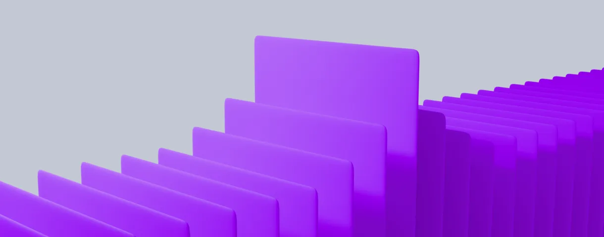
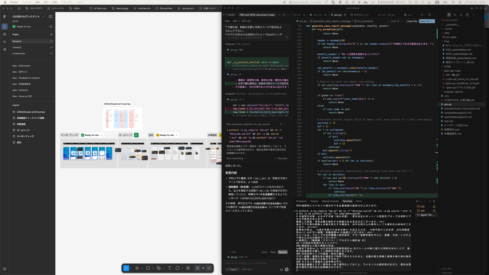

# Your slide deck

Start writing!

---

# 目次
- 自己紹介
- AI時代、デザイナーは必要なものを既に持っている
- アイデアの価値
- アイデアの1つの像
- 

---

# 自己紹介
UXマンという名前でやってる、UXリサーチとプロダクトデザインの10年選手です
- 2.5年正社員→7年フリーランスとか社長とか役員→2年正社員
- 元起業家。事業売却経験あり。
2回目の起業では失敗。成功と失敗両方を経験した貴重()な人材。
- AI大好き
- 個人投資家。不動産オーナー。

---

# 作ったもの
- 奥さんのメール仕事を助けるAI
- 知り合いの不動産屋のおじちゃんの不動産リサーチを効率化・平準化するAI
- AIに関するニュースサイトを毎日制作・運営するAIエージェント

---

担当した新規事業担当。デザイナー兼PdMとして携わった。
コーポレート部門向けのAI製品。
現在は**ARR数千万円**を稼ぐ製品になっている

---

# 最近のデザイナー兼PdM
開発してる。
AIによって、本当に誰でも作れる世界になったから。

---

# 必要なのは、 集中する時間と発想力だけ。

> *以前はプログラミングを学ぶことが明らかに正しい選択だった。でも今は違う。 **高い主体性、アイデアを生み出す上手さ、折れない心、急速に変化する世界への順応力といったスキルが、特定のスキルよりも重要になる***
>
> Sam Altman

---

「アイデアに価値は無い」

---

「アイデアに価値は無い」❌️

---

「アイデアに価値がある」:face_with_diagonal_mouth:

---

「完成形をイメージできる詳細度のアイデアに価値がある」✅️

---

# 作ろう
>完成形をイメージできる詳細度のアイデア

---

# それってどんなもの？
>完成形をイメージできる詳細度のアイデア

---

# 従来の開発戦術
- リサーチ・機会発見(PdM/UXリサーチャー) → 要件定義(PdM) → 仕様・設計定義(エンジニア)  & UIデザイン(デザイナー) → ハンドオフ → 実装
- リサーチ・機会発見(PdM/UXリサーチャー) → プロトタイピング(エンジニア, デザイナー) → 要件定義(PdM) → 仕様・設計定義(エンジニア) → ハンドオフ → 実装

---

# 変化した開発戦術
リサーチ・機会発見(PdM/UXリサーチャー) → ユースケース記述(PdM) → PRD, SPEC(**AI**) → CLIベースのプロトタイピング(**AI**) → ブラッシュアップ(**AI** with デザイナー) → PRD・SPEC修正(**AI**) → ハンドオフ(**AI**) → 仕様・設計定義(エンジニア) → 実装

---

# 1. ユースケース記述

主体ごとの挙動をシナリオベースで叙述した作文。
*(※叙述=物事が起きる順に述べたもの)*

---

1. ユーザーはホーム画面を開く
2. アプリはホーム画面を表示する
3. アプリはニュース一覧を表示する
4. ユーザーはいずれかのニュースを開く
5. アプリは当該ニュースを表示する
6. ユーザーは当該ニュースを読む
7. ユーザーは当該ニュースをお気に入り登録する
8. アプリはユーザー登録を促す
9. ユーザーは...

*(ニュースアプリのイメージ)*

---

# 2. AIにPRD, SPECを書かせる
ユースケースを基にする

---

「@usecase.mdをもとにPRDとSPECを書いて」

---

動画ないし画像

---

# 3. コマンドラインで動くものを作ろう
ビジュアルから作り始めない。動くものから作る。

---

ターミナル(黒い画面)で動くこと。

---

どうやるの？

---

がんばる。

---

がんばる = デザイナーとして培った言語化能力を全力でつぎ込む。

---

動画ないし画像

---

# 4. リバースエンジニアリングして PRD・SPECを作らせよう

PRDやSPECを人間が書く必要は無い。

---

「コードベースを読み込み、リバースエンジニアリング的にPRDとSPECを作成して」

---

# 5. AIに聞いてもらう というハンドオフ
ハンドオフも人間がやる必要は無い。

---

エンジニア
「吉永さん、ここってどうしてこういう仕様にしたんですか？」

---

分からない。

---

理由は色々ある。

- 何か意図はあった。でもAIに指示しただけなのであんまり憶えてない。
- プロトタイプ終えてから随分時間が経ってから実装着手された。時間経ちすぎて憶えてない。
- コーディングエージェントが勝手にやった
etc...

---

## コードに「WHY」は書かれていない。
コードベースに対して質問すればいいと思っていた
でもコードは結果に過ぎない。何故そうしたのかはコード読んでも分からない。
(コメントは多少付いているけど)

これは、読み手が人間でもAIでも同じ。

---

## 忘れてもいいようにしよう。

---

## 開発日記を付ける
「ここまでの変更の具体と意図を開発日記に記載しておいて」
*(※毎回書くと面倒なので、コミットごとに動くSkillsかRulesを作っておく)*

動画ないし画像

---

## 解決 :white_check_mark:

AI「X月X日に、XXXという経緯があったようです」

---

# 整理・まとめ

---

## デザイナーは、 今まで以上に 体験をデザインできるようになった。
**完成形をイメージできる詳細度のアイデア** を持とう。
そして、そのレベルを上げよう。

---

## 完成形をイメージできる詳細度のアイデアって何？
例えば以下のようなもの。
- LVL1: ユースケース記述
- LVL2: PRD, SPEC (AIに作らせてOK)
- LVL3: CLIベースのプロトタイプ
- LVL4: 3と同期したPRD+SPEC+開発日記
- LVL5: 4と同期したUIデザイン

---

# Appendix
## UIデザインはどこ？
UIデザインは、UIだけを独立して作る時代ではなくなってきた。

実際の出力形態やデータのあり方を見て、良いUIにデータを落とし込めるか想像しながら、機能・挙動自体をブラッシュアップする という、より包括的な活動に変わった。

---

## FigmaとCursorが画面に並んでいる
吉永の普段の作業環境

