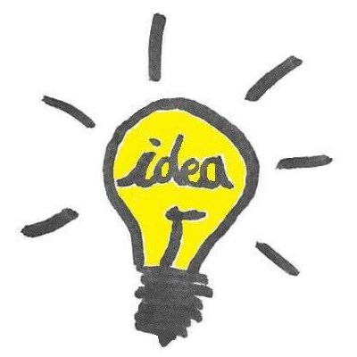
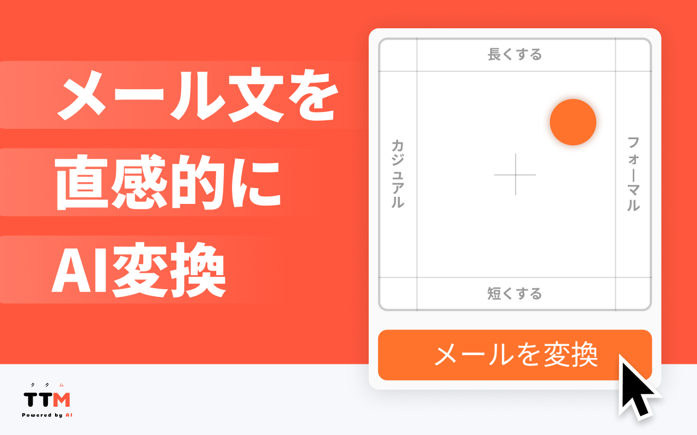
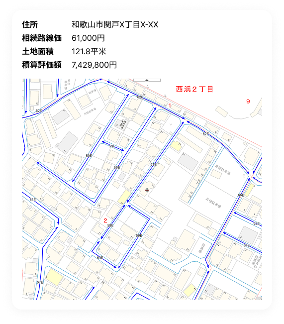
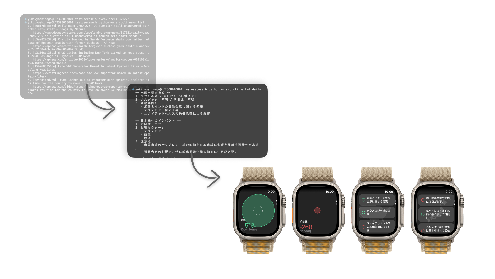
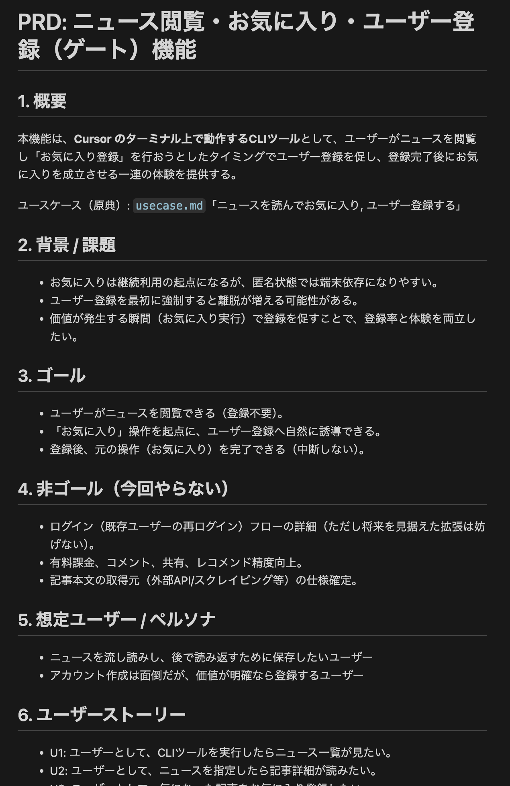
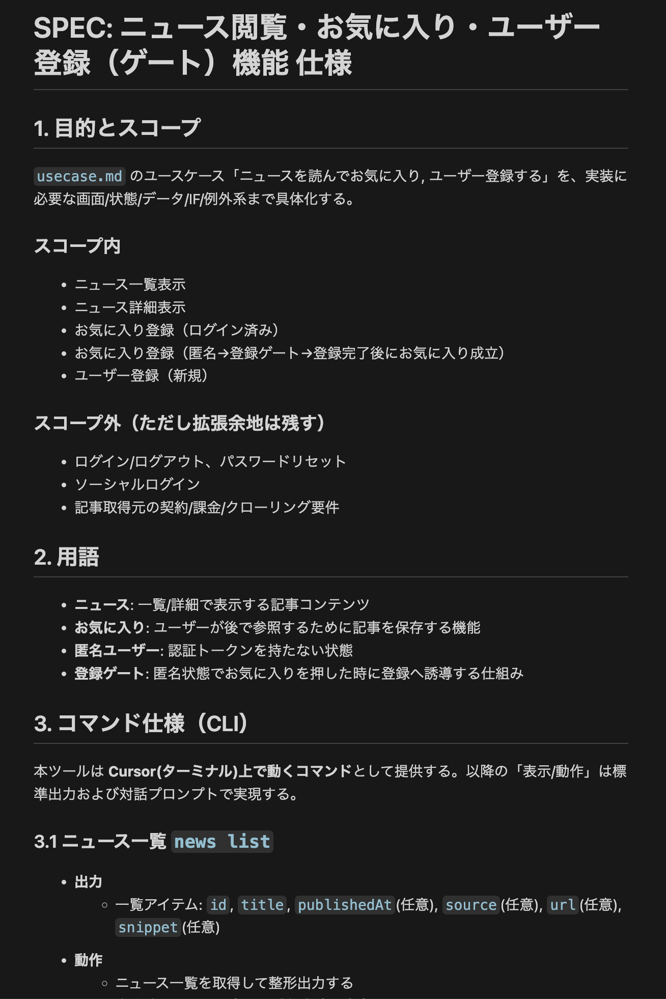
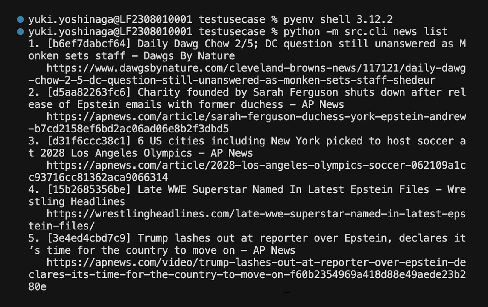
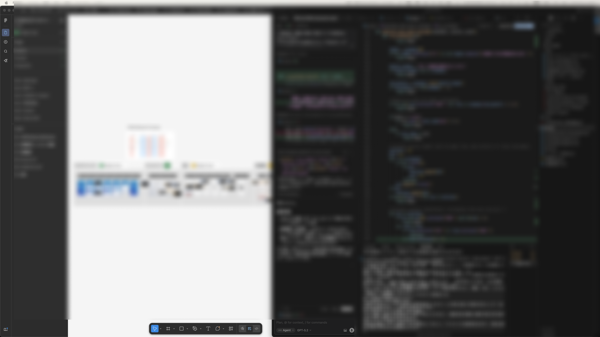

<!-- _class: title-slide -->

# AI時代に必要な アイデアの形
AI時代って楽しいね。

LegalOn Technologies, PdM / Product Designer  
吉永悠記 a.k.a UXマン   

---

<!-- _class: toc-slide -->

  <h1>目次</h1>
  <h2>Index</h2>

1. 自己紹介
2. アイデアに価値はない？
3. 価値あるアイデア
4. 開発戦術の変化
5. アイデアのレベル

---

<!-- _class: section-start -->

  

    <h1>自己紹介</h1>
  

  

    
  

---

## 吉永悠記 

### プロフィール
LegalOn Technologiesにて、新規事業チームでリードデザイナー兼PdM。UXリサーチとプロダクトデザインの10年選手。X等で"UXマン"として知られる。AIと妻が大好き。投資家。にじさんじ推し。一児のパパ(予定)

### 職歴
UXリサーチからキャリアStart。
Makuake > Branding Engineer > メディアドゥ > パーソルキャリア > エンタメアプリで起業 > 事業売却 > 二度目の起業 > 現職。コーポレート部門やCXO向けのソリューションに携わる。

---

<!-- _class: fullscreen-background -->
<!-- パターン: E. 背景・画像系 / 用途: 事例紹介など、背景画像＋ロゴ＋説明文＋補足要素を配置したい時。 -->

コーポレート部門向けのAI製品。 デザイナー兼PdMとして担当した新規事業。 現在は、DXを積極的に推進する企業・自治体に導入される製品として成長中。

  

---

## 個人開発

<!-- パターン: B. カラムレイアウト系 / 用途: 画像付きカードを3つ並べて紹介したい時。 -->

  

    
    

      
メール仕事を助けるAI

      
奥さんのメール業務補助

      
Chrome拡張機能

    

  

  

    
    

      
不動産価格リサーチAI

      
知り合いの不動産屋の業務平準化

      
PCアプリ

    

  

  

    
    

      
AIニュースを運営するAI

      
個人投資家のためのAIアンテナ

      
WEBサイト, Webhook API

    

  

---

## 「アイデアに価値は無い」

---

## 「アイデアに価値は無い」❌️

---

## 「アイデアに価値がある」🫤

---

## 完成形をイメージできる詳細度のアイデアを 作れることに価値がある✅️

"ニーズのあるアイデア"とか"課題解決できるアイデア"といった答えもあるかもしれないが、 そういうのは当たり前すぎるので一旦なし

---

### このために戦術を変更した
> 完成形をイメージできる詳細度のアイデア

---

---

<ul class="icon-card-list">
  <li class="icon-card">
    👨‍💻
    

      
エンジニア

      
「ここはなぜこの仕様にしたんですか」

    

  </li>
  <li class="icon-card">
    🤔
    

      
吉永

      
「何でやろなあ」（わからない・忘れた）

    

  </li>
  <li class="icon-card">
    🤖
    

      
AI

      
「X月X日に、XXXという経緯があったようです」

    

  </li>
</ul>

---

## アイデアのレベル
<!-- パターン: B. カラムレイアウト系 / 用途: レベルや成熟度を段階的に示す時。 -->

  

    
Lv.1

    
ユースケース記述

  

  

    
Lv.2

    
PRDとSPEC

  

  

    
Lv.3

    
CLI試作

  

  

    
Lv.4

    
ハンドオフ付き

  

  

    
Lv.5

    
UI付き

  

**レベルに伴ってアイデアの価値も上がる**。
高レベルな方が完成形をイメージできる。作らないとアイデアのレベルは上がらない。
アイデア段階で手を動かせ。

(※そのアイデアがヒットする蓋然性レベルではない)

---

# 結果

## 楽しい。

既に2,3ヶ月で5機能がデザイナーから生まれた(小機能だが)。
表象でなくデータやプロトコルといった実体の設計。
つまり、**従来よりも本当の意味でデザインしている**。

(本番リリースのためのエンジニアの協力はある)

---

<!-- _class: section-end -->
# AI時代、
## ~~アイデアを重視しよう~~ アイデアの詳細度を重視しよう。
デザイナーらしく。

---

<!-- _class: title-slide -->

## ありがとうございました

ご質問とご意見をお待ちしています。
このスライドはAIで作りました。

Yuki Yoshinaga   
@uxman

---

# Appendix

---

<!-- パターン: D. パネルデザイン系 / 用途: 上下に2つのフローを並べて比較したい時。 -->

<h3 style="margin: 0 0 12px 0; font-size: 24px; font-weight: 700; color: #374151;">従来の開発戦術</h3>

<ol class="process-flow">
  <li>
1

議論
</li>
  <li>
2

要件
</li>
  <li>
3

議論
</li>
  <li>
4

仕様設計
</li>
  <li>
5

議論
</li>
  <li>
6

UI
</li>
  <li>
7

議論
</li>
  <li>
8

ハンドオフ
</li>
  <li>
9

実装
</li>
</ol>

<h3 style="margin: 0 0 12px 0; font-size: 24px; font-weight: 700; color: #374151;">変化した開発戦術</h3>

<ol class="process-flow">
  <li>
1

ユースケース記述 (ヒト)
</li>
  <li>
2

PRDとSPEC (AI)
</li>
  <li>
3

CLI試作 (ヒト＜AI)
</li>
  <li>
4

ブラッシュアップ (ヒト＞AI)
</li>
  <li>
5

ハンドオフ (AI)
</li>
  <li>
6

実装 (ヒト&AI)
</li>
</ol>

AI前提の仕事の流れ

---

<!-- パターン: B. カラムレイアウト系 / 用途: 左で定義を伝え、右で手順例を並べて理解を促す時。 -->

  
1

  <h2 style="font-size: 28px; font-weight: 700; color: #374151;">ユースケース記述</h2>

  主体ごとの挙動をシナリオベースで 叙述した作文。
  物事が起きる順に行動と システムの反応を並べる。

<ol class="usecase-steps">
  <li>ユーザーはホーム画面を開く</li>
  <li>アプリはホーム画面を表示する</li>
  <li>アプリはニュース一覧を表示する</li>
  <li>ユーザーはいずれかのニュースを開く</li>
  <li>アプリは当該ニュースを表示する</li>
  <li>ユーザーは当該ニュースを読む</li>
  <li>ユーザーは当該ニュースをお気に入り登録する</li>
  <li>アプリはユーザー登録を促す</li>
  <li>ユーザーは...</li>
</ol>

---

  

    
2

    <h2 style="font-size: 28px; font-weight: 700; color: #374151;">PRD と SPEC の生成</h2>
  

  

    ユースケースをもとに、 PRDとSPECを生成する。 
    AIの方が人より安定的で上手で早い。
  

  

---
<!-- パターン: B. カラムレイアウト系 / 用途: 画像を2つ並べて見せたい時。 -->

  

    
  

  

    
  

---

  
3

  <h2>CLI(コマンドライン)試作</h2>

  

    ビジュアルから始めない。動くものから作る。 
    どんなデータを作れるか、どんなデータが来るか 試行錯誤。
  

  

---

  
4

  <h2>ブラッシュアップ(頑張る)</h2>

  

    
    

      
良い素材を探す・作る

      
質を上げるため使うデータソースやAPIを見直す・選定する。

    

  

  

    
    

      
ターゲットやコンセプト見直し

      
インスピレーションを得て企画レベルの発想転換をする。

    

  

  

    
    

      
最適なUIを考える

      
実際のデータの形や特性を見て、UIを最適化する。

    

  

---

  
5

  <h2>ハンドオフもAIが答える</h2>

企業における開発の場合、大抵ハンドオフやレビューが必要。 その材料提供も、AIの方が上手。

<ul class="icon-card-list">
  <li class="icon-card">
    👨‍💻
    

      
エンジニア

      
「ここはなぜこの仕様にしたんですか」

    

  </li>
  <li class="icon-card">
    🤔
    

      
吉永

      
💦（わからない・忘れた）

    

  </li>
  <li class="icon-card">
    🤖
    

      
AI

      
「X月X日に、XXXという経緯があったようです」

    

  </li>
</ul>

---

## FAQ

### UIデザインはどこへ行ったか
UIデザインは、UIだけを独立して作る時代ではなくなってきた。

実際の出力形態やデータのあり方を見て、良いUIにデータを落とし込めるか想像しながら、機能・挙動自体をブラッシュアップする という、より包括的な活動に変わった。

---

## FAQ

  <h3 style="margin: 0 0 20px 0; font-size: 28px; font-weight: 700; color: #374151;">1. 色々やっているようだが 作業環境は？何使ってるの?</h3>
  

    こんな感じ→ 
    Figma, Cursor, Antigravityが多い。
  

  

---

## FAQ

### 2. AIにハンドオフさせるって、具体的には何をすればいいの？

<ul class="icon-card-list">
  <li class="icon-card">
    📋
    

      
基礎的な設計の伝達

      
リバースエンジニアリングでPRDとSPECを更新。PRDやSPECを通じて、設計の意図や構造を明確に伝える

    

  </li>
  <li class="icon-card">
    📝
    

      
経緯のトレーサビリティ向上

      
AIに開発日記を付けさせる。開発日記とコミットメッセージで、なぜそうしたかを記録し備忘する

    

  </li>
</ul>

---

## 経緯のトレーサビリティ向上の重要性

### Point1. 人はそもそも忘れる生き物。

- 作り終えてずいぶん時間が経ってからエンジニアがアサインされ、記憶が薄れている
- 指示しただけなので記憶に定着しておらず、意図を思い出せない
- エージェントが勝手に進めた部分がある

---
## 経緯のトレーサビリティ向上の重要性
### Point2. コードにWHYは書かれていない

結果としての実装物(コード)は残る。  
でも、なぜそうしたかは残りにくい。

---

## 経緯のトレーサビリティ向上の重要性
### 対策: 忘れてもいいようにする

「ここまでの変更の具体と意図を開発日記に記載しておいて」
(※毎回書くと面倒なので、コミットごとに動くSkillsかRulesを作っておく)

